# Swift Eats - System Architecture

This document provides a comprehensive overview of the Swift Eats backend architecture, design patterns, and system components.

## 🏗️ Architecture Overview

Swift Eats follows a **Modular Monolith** architecture pattern, providing the benefits of microservices organization while maintaining the simplicity of a single deployable unit.

### Key Architectural Principles

- **Domain-Driven Design (DDD)**: Each module represents a bounded context
- **Separation of Concerns**: Clear boundaries between business logic, data access, and presentation
- **Event-Driven Architecture**: Asynchronous communication through events
- **CQRS Pattern**: Command Query Responsibility Segregation for complex operations
- **Outbox Pattern**: Reliable event publishing with transactional guarantees

## 🎯 Complete System Architecture

```mermaid
graph TB
    subgraph "Client Applications"
        WEB["🌐 Web App<br/>(React/Vue)"]
        MOBILE["📱 Mobile App<br/>(React Native)"]
        ADMIN["⚙️ Admin Dashboard"]
        DRIVER["🚗 Driver App"]
    end

    subgraph "Load Balancer"
        LB["🔄 Nginx<br/>Load Balancer"]
    end

    subgraph "Swift Eats Backend (NestJS)"
        subgraph "API Layer"
            AUTH_API["🔐 Auth API"]
            CATALOG_API["📋 Catalog API"]
            ORDERS_API["🛒 Orders API"]
            PAYMENTS_API["💳 Payments API"]
            LOGISTICS_API["🚚 Logistics API"]
            TELEMETRY_API["📊 Telemetry API"]
            ANALYTICS_API["📈 Analytics API"]
            SIMULATOR_API["🎮 Simulator API"]
        end

        subgraph "Real-time Layer"
            WS_GATEWAY["🔌 WebSocket Gateway<br/>(Socket.io)"]
        end

        subgraph "Business Logic"
            AUTH_SVC["Auth Service"]
            CATALOG_SVC["Catalog Service"]
            ORDERS_SVC["Orders Service"]
            PAYMENTS_SVC["Payments Service"]
            LOGISTICS_SVC["Logistics Service"]
            TELEMETRY_SVC["Telemetry Service"]
            ANALYTICS_SVC["Analytics Service"]
            SIMULATOR_SVC["Simulator Service"]
        end
    end

    subgraph "Data Storage"
        POSTGRES[("🐘 PostgreSQL<br/>Primary Database")]
        MONGODB[("🍃 MongoDB<br/>Telemetry Data")]
        REDIS[("🔴 Redis<br/>Cache & Sessions")]
    end

    subgraph "External Services"
        PAYMENT_GW["💰 Payment Gateway<br/>(Stripe/Razorpay)"]
        MAPS_API["🗺️ Maps API<br/>(Google Maps)"]
        NOTIFICATION["📧 Notification<br/>(Email/SMS)"]
    end

    %% Client to Load Balancer
    WEB --> LB
    MOBILE --> LB
    ADMIN --> LB
    DRIVER --> LB

    %% Load Balancer to APIs
    LB --> AUTH_API
    LB --> CATALOG_API
    LB --> ORDERS_API
    LB --> PAYMENTS_API
    LB --> LOGISTICS_API
    LB --> TELEMETRY_API
    LB --> ANALYTICS_API
    LB --> SIMULATOR_API
    LB --> WS_GATEWAY

    %% APIs to Services
    AUTH_API --> AUTH_SVC
    CATALOG_API --> CATALOG_SVC
    ORDERS_API --> ORDERS_SVC
    PAYMENTS_API --> PAYMENTS_SVC
    LOGISTICS_API --> LOGISTICS_SVC
    TELEMETRY_API --> TELEMETRY_SVC
    ANALYTICS_API --> ANALYTICS_SVC
    SIMULATOR_API --> SIMULATOR_SVC

    %% Services to Databases
    AUTH_SVC --> POSTGRES
    CATALOG_SVC --> POSTGRES
    ORDERS_SVC --> POSTGRES
    PAYMENTS_SVC --> POSTGRES
    LOGISTICS_SVC --> POSTGRES
    ANALYTICS_SVC --> POSTGRES
    TELEMETRY_SVC --> MONGODB
    SIMULATOR_SVC --> REDIS

    %% Redis Connections
    AUTH_SVC --> REDIS
    ORDERS_SVC --> REDIS
    LOGISTICS_SVC --> REDIS
    WS_GATEWAY --> REDIS

    %% External Services
    PAYMENTS_SVC --> PAYMENT_GW
    LOGISTICS_SVC --> MAPS_API
    ORDERS_SVC --> NOTIFICATION

    %% Real-time connections
    WEB -.->|WebSocket| WS_GATEWAY
    MOBILE -.->|WebSocket| WS_GATEWAY
    DRIVER -.->|WebSocket| WS_GATEWAY

    classDef clientStyle fill:#e1f5fe,stroke:#01579b,stroke-width:2px
    classDef apiStyle fill:#f3e5f5,stroke:#4a148c,stroke-width:2px
    classDef serviceStyle fill:#e8f5e8,stroke:#1b5e20,stroke-width:2px
    classDef dataStyle fill:#fff3e0,stroke:#e65100,stroke-width:2px
    classDef externalStyle fill:#fce4ec,stroke:#880e4f,stroke-width:2px

    class WEB,MOBILE,ADMIN,DRIVER clientStyle
    class AUTH_API,CATALOG_API,ORDERS_API,PAYMENTS_API,LOGISTICS_API,TELEMETRY_API,ANALYTICS_API,SIMULATOR_API,WS_GATEWAY apiStyle
    class AUTH_SVC,CATALOG_SVC,ORDERS_SVC,PAYMENTS_SVC,LOGISTICS_SVC,TELEMETRY_SVC,ANALYTICS_SVC,SIMULATOR_SVC serviceStyle
    class POSTGRES,MONGODB,REDIS dataStyle
    class PAYMENT_GW,MAPS_API,NOTIFICATION externalStyle
```

## 🔄 Order Lifecycle Flow

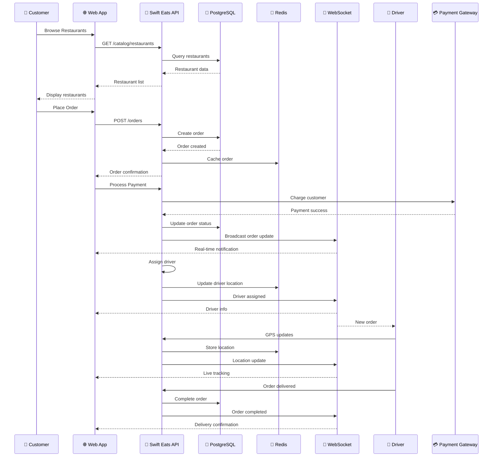

## 🏗️ Microservices Architecture

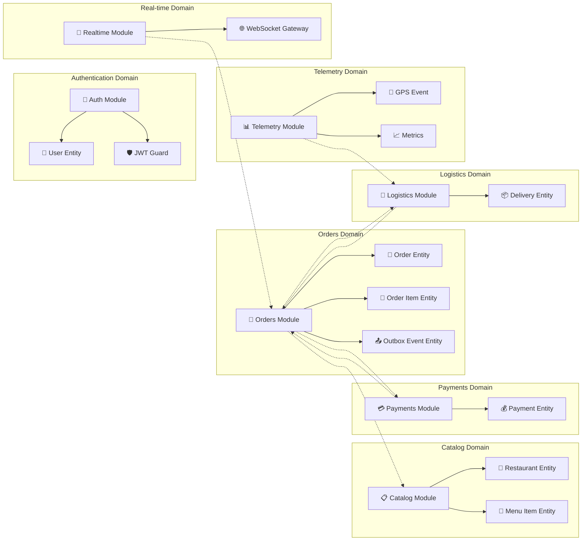

## 🎯 System Components Diagram

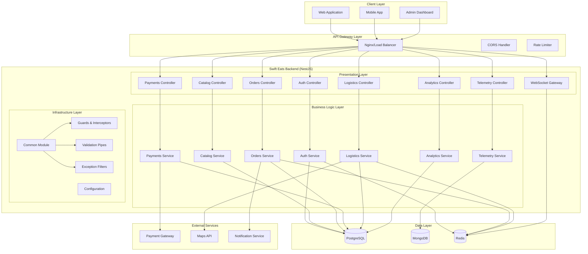

## 🔄 Real-time Data Flow

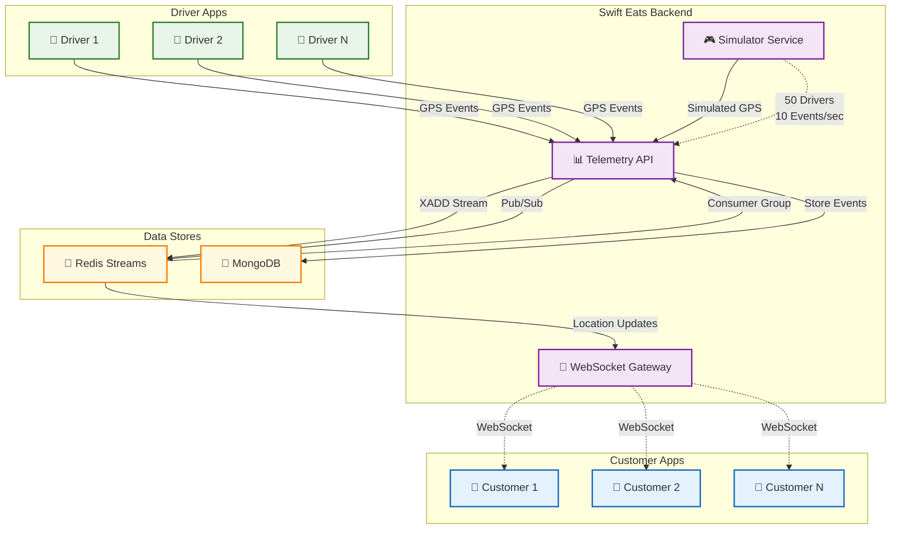

## 📊 Load Testing Architecture

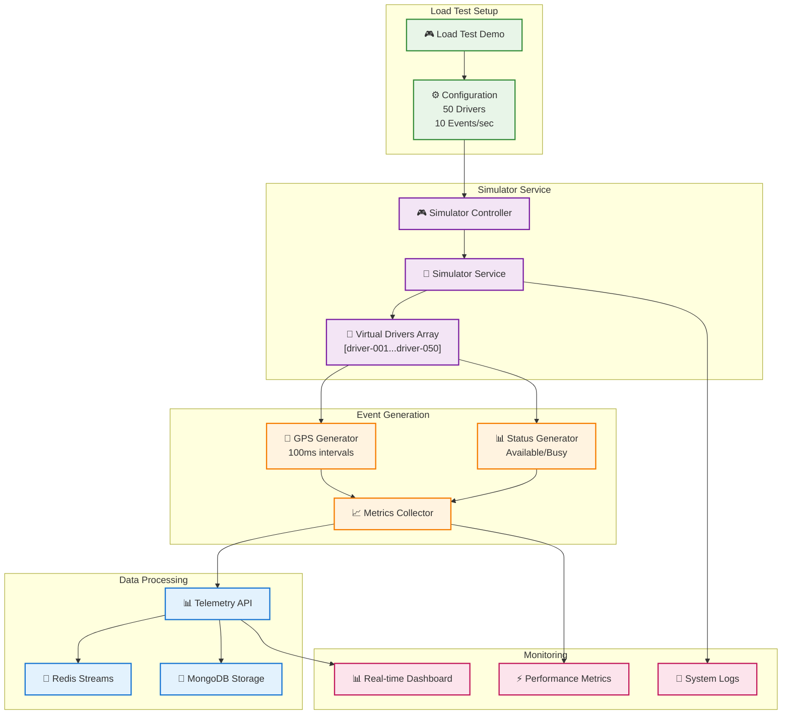

## 🏛️ Module Architecture

### Core Business Modules

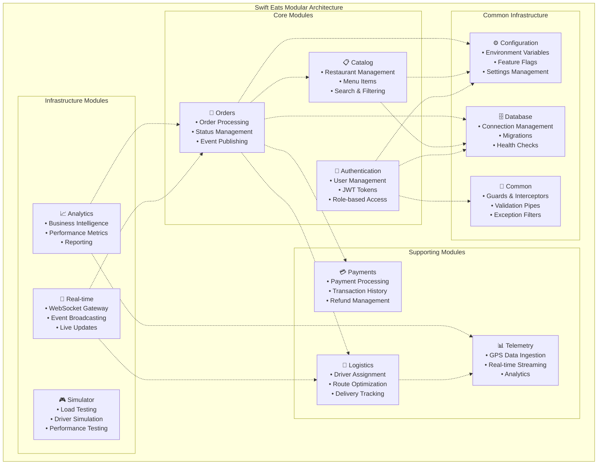

## 🗄️ Database Architecture

### Multi-Database Strategy

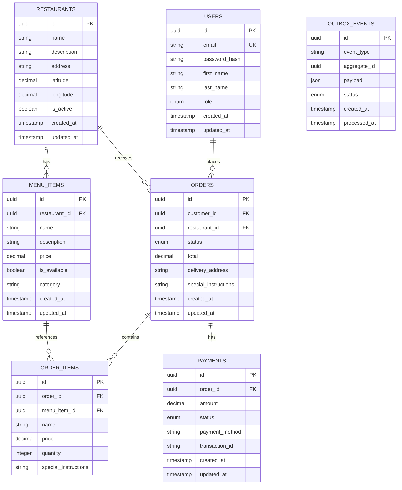

### MongoDB Collections (Telemetry)

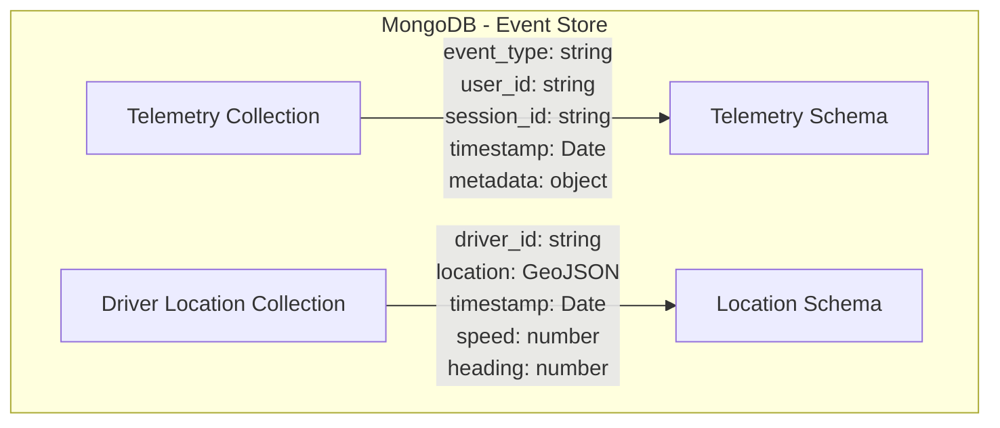

### Redis Data Structures

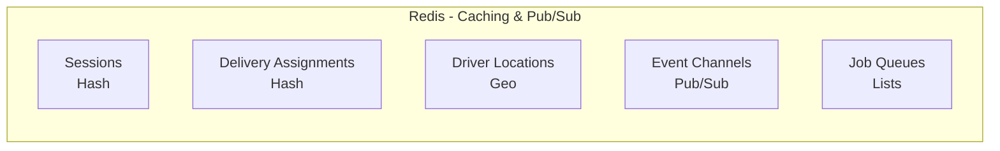

## 🔄 Event-Driven Architecture

### Event Flow Pattern

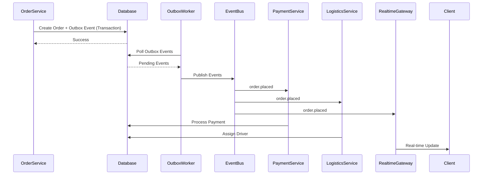

### Event Types

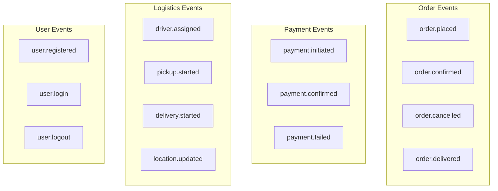

## 🔐 Security Architecture

### Authentication & Authorization Flow

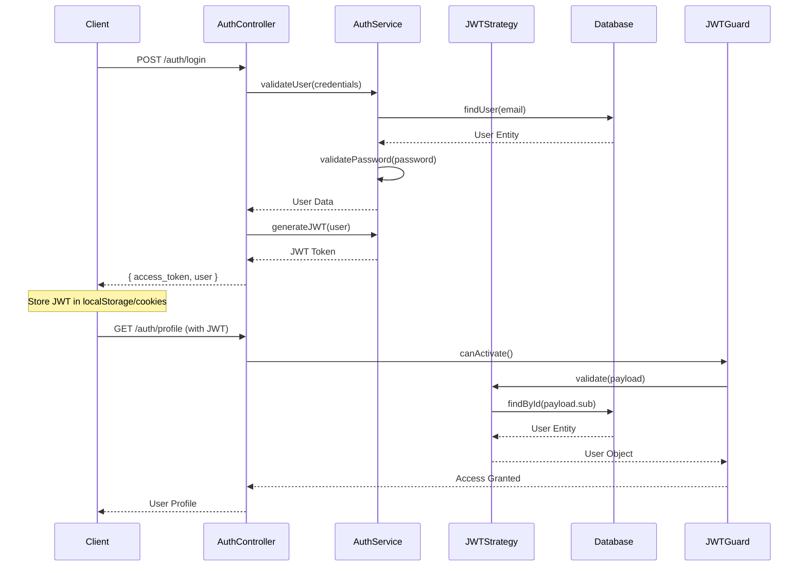

### Security Layers

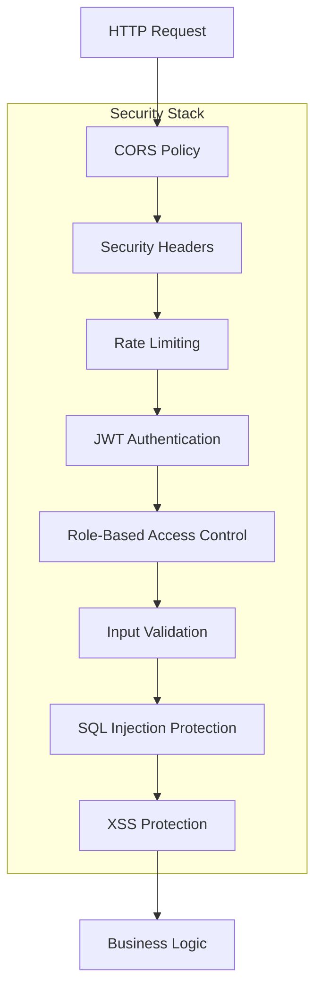

## 🚀 Deployment Architecture

### Container Architecture

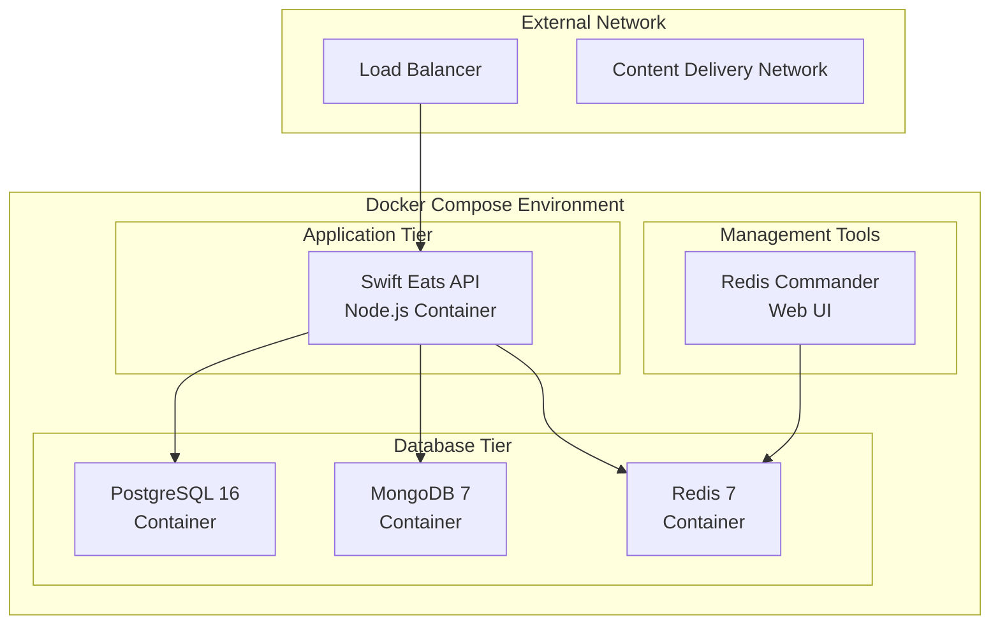

### Production Deployment

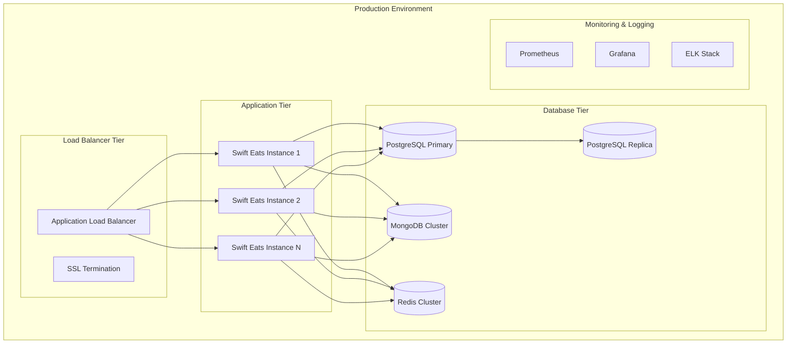

## 📊 Performance & Scalability

### Caching Strategy

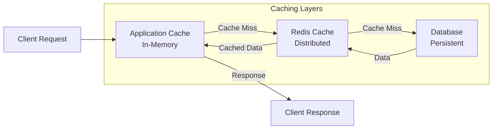

### Horizontal Scaling Points

- **Application Instances**: Stateless design allows horizontal scaling
- **Database Read Replicas**: Read operations can be distributed
- **Redis Cluster**: Cache and session data distributed
- **MongoDB Sharding**: Telemetry data can be sharded by time/user
- **WebSocket Connections**: Can be load balanced with sticky sessions

## 🔍 Monitoring & Observability

### Observability Stack

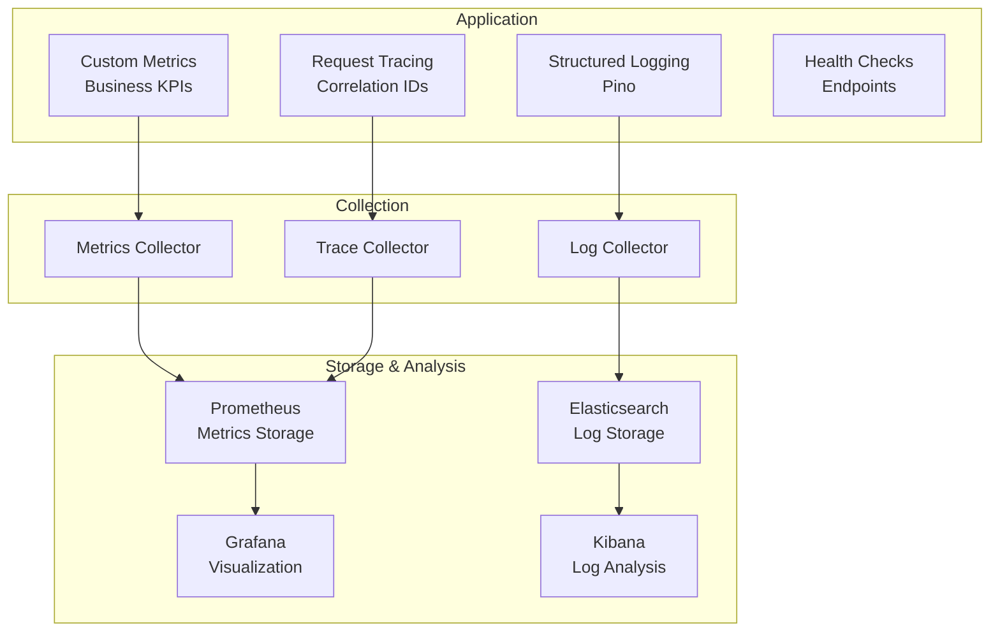

## 🎯 Design Patterns Summary

### Implemented Patterns

1. **Module Pattern**: Domain-driven module organization
2. **Repository Pattern**: Data access abstraction
3. **Factory Pattern**: Entity and DTO creation
4. **Observer Pattern**: Event-driven communication
5. **Strategy Pattern**: Multiple authentication strategies
6. **Decorator Pattern**: Guards, interceptors, and pipes
7. **Command Pattern**: CQRS implementation
8. **Outbox Pattern**: Reliable event publishing
9. **Saga Pattern**: Distributed transaction management
10. **Circuit Breaker**: External service resilience

### Architectural Benefits

- **Maintainability**: Clear separation of concerns
- **Testability**: Dependency injection and mocking
- **Scalability**: Horizontal scaling capabilities
- **Reliability**: Event-driven resilience
- **Performance**: Multi-layer caching strategy
- **Security**: Defense in depth approach
- **Observability**: Comprehensive monitoring

This architecture provides a solid foundation for a production-ready food delivery platform with room for future growth and feature expansion.
